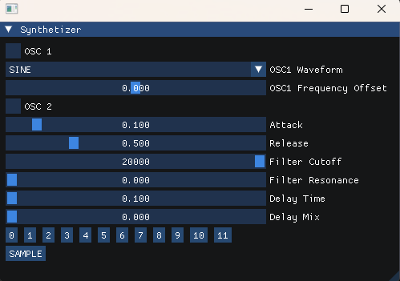

# Audio Synthesizer
Audio synthesizer that allows to play notes using multiple waveforms (sine, saw, square) with frequency offsets, filters, and delay effects

## Table of Contents
- [About](#about)
- [Features](#features)
- [Tech Stack](#tech-stack)
- [Getting Started](#getting-started)
  - [Prerequisites](#prerequisites)
  - [Installation](#installation)
- [Usage / Examples](#usage--examples)
  - [Keyboard Mapping](#keyboard-mapping)

## About
A simple audio synthesizer built with C++ and ImGui. It supports multiple oscillators,
waveform selection, filters, delay effects, and basic note playback through either the 
[keyboard](#keyboard-mapping) or GUI buttons.

## Screenshot
<p align="center">
  
</p>
<p align="center">
  <em>Main GUI with oscillators, envelopes, filters, delay and note buttons</em>
</p>

## Features
- **Oscillators**
  - Oscillator 1: square, saw, or sine waveforms with optional frequency offset  
  - Oscillator 2: square, saw, or sine waveforms  

- **Envelopes & Filters**
  - Attack & Release controls  
  - Filter Cutoff and Filter Resonance  

- **Delay Effects**
  - Adjustable Delay Time and Delay Mix  

- **Playback**
  - 12 playable notes using keyboard or on-screen buttons  
  - "Sample" button to play a preloaded audio sample  

## Tech Stack
<p align="center">
  
  
  
</p>

## Getting Started

### Prerequisites
Make sure you have the following installed on your system:

- **CMake** [Download here](https://cmake.org/download/)
- **C++ Compiler**
  - On Windows: [MinGW-w64 (via MSYS2)](https://www.msys2.org/)  
  - On Linux: `sudo apt install build-essential`  
  - On macOS: `xcode-select --install`
- **Make tool** (`mingw32-make` on Windows, `make` on Linux/macOS)
- **Git**

### Installation
- Clone the project: ```git clone https://github.com/yourusername/Audio-Synthesizer.git```
- Open the project's root folder: ```cd Audio-Synthesizer```
- Create and enter the build directory: ```mkdir build && cd build```
- Run ```cmake -G "MinGW Makefiles" ..```
- Run ```cmake --build .```
- Run the .exe: 61610.synthetizer

### Usage / Examples
- Run the program from the build folder: ```./61610.synthetizer```
- Adjust oscillator waveforms (sine, saw, square)
- Apply frequency offsets (Oscillator 1 only)
- Modify Attack/Release, Filter Cutoff, Filter Resonance
- Experiment with Delay Time and Delay Mix
- Use the Sample button to play a preloaded sample

#### Keyboard Mapping
| Keyboard | On-screen Button | Frequency (Hz) |
|----------|------------------|----------------|
| Q        | Button 0         | 220.00         |
| Z        | Button 1         | 233.08         |
| S        | Button 2         | 246.94         |
| E        | Button 3         | 261.63         |
| D        | Button 4         | 277.18         |
| F        | Button 5         | 293.66         |
| T        | Button 6         | 311.13         |
| G        | Button 7         | 329.63         |
| Y        | Button 8         | 349.23         |
| H        | Button 9         | 369.99         |
| U        | Button 10        | 392.00         |
| J        | Button 11        | 415.30         |
